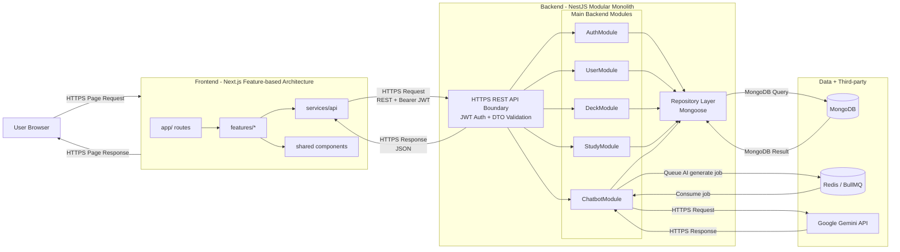

# Quizzy Architecture

Style:

- Frontend: Feature-based Architecture.
- Backend: Modular Monolith.
- Frontend and Backend communicate through HTTPS REST APIs.

## Simplified Architecture Diagram

## Module Scope

| Module | Main responsibility |
|---|---|
| `AuthModule` | Register, login, logout, JWT authentication, current user session. |
| `UserModule` | User profile and user account data. |
| `DeckModule` | Deck library, deck detail, deck ownership, deck cards as learning content. |
| `StudyModule` | Study sessions, study items, reviews, review sync, study result flow. |
| `ChatbotModule` | AI chat, deck-aware chat, generate flashcards from text/PDF, poll AI jobs. |

## Important HTTPS Flows

| Flow | HTTPS request | HTTPS response |
|---|---|---|
| Login | `POST /v1/auth/login` | JWT + user data |
| Current user | `GET /v1/auth/me` | Current user profile |
| My decks | `GET /v1/decks/my` | Deck list |
| Deck detail | `GET /v1/decks/:id` | Deck data |
| Deck cards | `GET /v1/cards/deck/:deckId` | Card list |
| Start study | `POST /v1/study/sessions` | Study session |
| Study items | `GET /v1/study/sessions/:sessionId/items` | Flashcard/study items |
| Log review | `POST /v1/study/reviews` | Review result |
| Chat message | `POST /v1/chatbot/conversations/:id/messages` | User + assistant messages |
| Generate flashcards | `POST /v1/chatbot/generate/text` or `POST /v1/chatbot/generate/pdf` | Queued AI job |
| Poll generate job | `GET /v1/chatbot/generate/jobs/:id` | Job status and `targetDeckId` when done |

## Drawing Notes

- Backend must be shown as one container: `NestJS Modular Monolith`.
- Do not draw backend modules as separate services.
- Frontend should be shown as one container: `Next.js Feature-based Architecture`.
- Label browser/frontend/backend arrows as `HTTPS Request` and `HTTPS Response`.
- Label Backend to Gemini as `HTTPS Request` and `HTTPS Response`.
- Do not label MongoDB or Redis connections as HTTPS.
